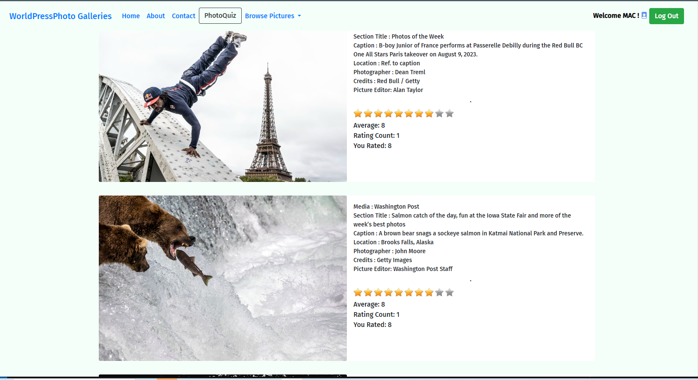

---

# WorldPressPhotoGallery

<p align="center">
  
</p>

**WorldPressPhotoGallery** is a web application designed for photojournalism enthusiasts. It allows users to view, select, and rate the most striking news images, highlighted for their photojournalistic impact.

Each week, we collect these emblematic images from major media outlets via **Scrapy** spiders. The collected data is then stored and displayed in **Django**, providing an interface where users can interact with the images, vote, and (soon) share their impressions.

## Main Features

- **Voting and Rating:** Registered users can vote for their favorite images (1 to 10 rating, or star rating).
- **Scraping with Scrapy:** Automatically gather fresh images from international publications.
- **Easy Setup:** Simple installation steps and environment configuration using `.env`.

## Technology Stack

- **Scrapy** (spiders for each media source)  
- **Django** (models, views, templates)  
- **SQLite3** database (by default)  
- **python-decouple** for environment variables  

## Supported Media (examples)

- Washington Post, CNN, Guardian, The Week, etc.  
- These often source from AP, Reuters, AFP, and other agencies.

---

## Installation & Usage

### 1. Clone the repository

```bash
git clone https://github.com/hericlibong/worldPressPhotoGalery
cd worldPressPhotoGalery
```

### 2. Create & activate a virtual environment

```bash
python -m venv venv
```

- **On Windows**:
  ```bash
  venv\Scripts\activate
  ```
- **On Unix/macOS**:
  ```bash
  source venv/bin/activate
  ```

### 3. Install dependencies

```bash
pip install -r requirements.txt
```

### 4. Configure environment variables

1. Copy (or rename) the sample file to `.env`:
   ```bash
   cp .env.sample .env
   ```
2. In **`.env`**, define at least:
   ```text
   SECRET_KEY=your_secret_key_here
   DEBUG=True
   ```
   *(For local development, `DEBUG=True` is fine; in production, you can set it to `False` and adjust accordingly.)*

### 5. Scrape the latest images

```bash
python runspiders.py
```
This will launch the Scrapy spiders that gather images from supported media outlets and store them in the local SQLite database.

### 6. Run the Django server

From the `webapp` directory (or wherever your `manage.py` is located):

```bash
cd webapp
python manage.py runserver
```

### 7. Access the application

Open your web browser and go to:
[http://127.0.0.1:8000/](http://127.0.0.1:8000/)  
You can now browse through and rate the photojournalistic images!

---

## Screenshots

<p align="center">
  
</p>

---

## Roadmap & Further Development

- **Refactoring** (splitting apps, improving pipeline, etc.)  
- **Dockerization**  
- **PhotoQuiz** (a quiz feature under development)  
- **Extended Media** (more spiders)  
- **CI/CD** (tests, GitHub Actions)

---

## Contributing

1. Fork the repository  
2. Create a branch (`git checkout -b feature/my-feature`)  
3. Commit your changes (`git commit -m "Add my feature"`)  
4. Push to the branch (`git push origin feature/my-feature`)  
5. Open a Pull Request

---


Voici un schéma résumé du flux, avec les principales étapes et quelques explications :

```
        ┌─────────────────────────────┐
        │ Collecte des données via    │
        │       Scrapy (spiders)      │
        └─────────────┬───────────────┘
                      │
                      │
                      ▼
        ┌─────────────────────────────┐
        │ Export des items en fichiers│
        │       JSON (via -O option)  │
        │   dans le dossier json_datas│
        └─────────────┬───────────────┘
                      │
                      │
                      ▼
        ┌─────────────────────────────┐
        │  Management Command Django  │
        │   (import_photos)           │
        │   lit les fichiers JSON     │
        └─────────────┬───────────────┘
                      │
                      │
                      ▼
        ┌─────────────────────────────┐
        │  Insertion via ORM dans     │
        │  les modèles Django         │
        │  (PhotoGallery, etc.)       │
        └─────────────┬───────────────┘
                      │
                      │
                      ▼
        ┌─────────────────────────────┐
        │  Base de données Django     │
        │ (SQLite, ou plus tard,       │
        │  PostgreSQL, etc.)          │
        └─────────────────────────────┘
```

**Explications complémentaires :**

1. **Scrapy** récupère et collecte les données grâce à ses spiders.
2. Chaque spider exporte automatiquement ses items au format JSON dans le dossier `json_datas/` (chaque spider génère son propre fichier, par exemple `guardian_picture.json`).
3. Une commande Django (`import_photos`) parcourt le dossier (ou un fichier spécifique) pour lire les fichiers JSON.
4. Pour chaque item lu, la commande utilise la méthode `update_or_create()` pour insérer ou mettre à jour les enregistrements dans le modèle `PhotoGallery`.
5. Les données finissent dans la base de données de l’application Django, prêtes à être utilisées par l’interface ou une API REST ultérieure.

Ce schéma illustre la décomposition du flux en deux parties distinctes :  
- **Collecte et export** (Scrapy et fichiers JSON)  
- **Import et insertion** (Commande Django et ORM)

Cela permet de travailler sur chaque partie de manière indépendante et d’assurer un traitement en lot efficace.

## License

This project uses the **MIT License** (or whichever you prefer).  

You’re free to modify the code, propose new features, or adapt it to your needs!

---

_Keep in mind this README can evolve as the project grows. For any questions or issues, feel free to open an Issue on GitHub._